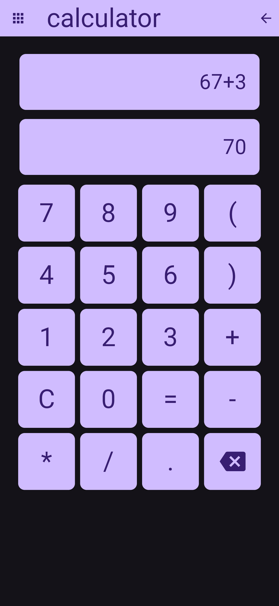

# Calculator App

This is a simple calculator application built using Flutter. The primary purpose of this project is to learn and practice Flutter development, including state management using the BLoC (Business Logic Component) pattern.

## Features

- Basic arithmetic operations: addition, subtraction, multiplication, and division.
- Clear and backspace functionalities.
- Light and dark theme support.
- Responsive design for better usability on mobile devices.

## Technologies Used

- **Flutter**: A UI toolkit for building natively compiled applications for mobile, web, and desktop from a single codebase.
- **BLoC**: A predictable state management library that helps to separate business logic from UI.

## Project Structure

The project is organized into the following main directories:

- `lib/views`: Contains the different pages of the application, such as the calculator page, home page, preferences page, and theme page.
- `lib/widgets`: Contains reusable widgets like the app bar and drawer.
- `lib/bloc`: Contains the BLoC implementation for managing the app's theme.

## Getting Started

To get started with this project, follow these steps:

1. **Clone the repository**:
   ```sh
   git clone https://github.com/joeCavZero/calculator-in-flutter.git
   ```

2. **Install dependencies**:
   ```sh
   flutter pub get
   ```

3. **Run the app**:
   ```sh
   flutter run
   ```

## Screenshots

<div style="display: flex; justify-content: space-around;">
  
  
</div>

## Learning Outcomes

This project was created with the intention of learning and practicing Flutter development. Through this project, I have gained experience in:

- Building responsive UIs with Flutter.
- Managing state using the BLoC pattern.
- Implementing themes and navigation in a Flutter app.

## License

This project is licensed under the MIT License. See the [LICENSE](LICENSE) file for more details.


